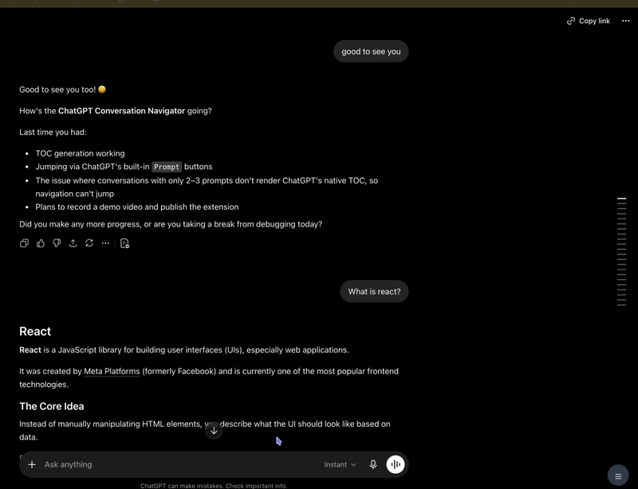

# ChatTOC

A lightweight Chrome extension that adds a Table of Contents (TOC) sidebar to ChatGPT conversations.

ChatTOC helps you navigate long conversations by automatically turning your prompts into a searchable, clickable outline.

---

## Features

- Automatically generates a TOC from user prompts
- Click any prompt to instantly jump to its location
- Search and filter prompts
- Highlights the prompt currently visible in the conversation
- Preview full prompt content on hover
- Automatically updates when new prompts are sent
- Resizable sidebar
- Show/hide toggle button
- Refresh button to rebuild the TOC
- Detects text, image, and file prompts
- Works entirely in the browser

---

## Demo



---

## Installation

### Option 1: Load Unpacked (Developer Mode)

1. Download or clone this repository.
2. Open Chrome and navigate to:

   ```text
   chrome://extensions
   ```

3. Enable **Developer Mode**.
4. Click **Load unpacked**.
5. Select the ChatTOC folder.

---

## Usage

1. Open any ChatGPT conversation.
2. The ChatTOC sidebar will appear on the right side.
3. Click a TOC item to jump to that prompt.
4. Use the search box to filter prompts.
5. Hover over a truncated prompt to preview the full content.
6. Drag the left edge of the sidebar to resize it.
7. Use the floating button to collapse or expand the sidebar.

---

## Why ChatTOC?

ChatGPT conversations can become very long, making it difficult to find previous prompts.

ChatTOC provides a lightweight navigation layer that lets you:

- Quickly revisit earlier questions
- Navigate long technical discussions
- Review project planning conversations
- Jump between different topics without endless scrolling

---

## Tech Stack

- JavaScript
- Chrome Extension (Manifest V3)
- DOM Manipulation
- MutationObserver
- Fetch Hooking
- Server-Sent Events (SSE)

---

## Privacy

ChatTOC runs entirely in your browser.

No conversation data is collected, stored, transmitted, or shared with any external service.

---

## License

MIT License
