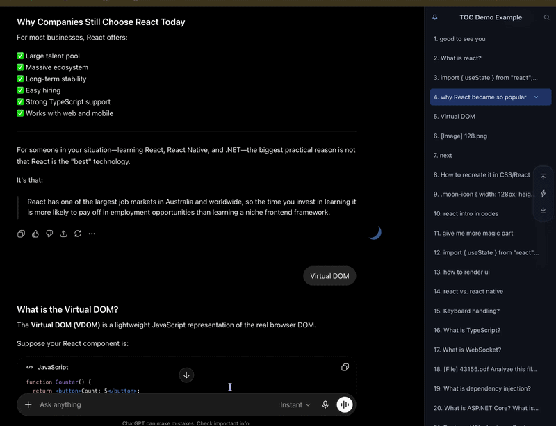

# ChatTOC

A lightweight Chrome extension that adds a Table of Contents (TOC) sidebar to ChatGPT conversations.

ChatTOC helps you navigate long conversations by automatically turning your prompts into a searchable, clickable outline.

👉 [Install from Chrome Web Store](https://chromewebstore.google.com/detail/chattoc/ibfdglfgljonajofiiaonlimoiolkcpa)

[](https://github.com/Leo7805/chat-toc/releases/latest)



---

## Features

- Automatically generates a TOC from user prompts
- Expand prompts to navigate answer headings
- Click any prompt to instantly jump to its location
- Mark important prompts for quick visual reference
- Search and filter prompts
- Save and reuse custom prompt templates
- Import and export saved prompts as editable Markdown files
- Autocomplete saved prompts inside ChatGPT's input box
- Highlights the prompt currently visible in the conversation
- Preview full prompt content on hover
- View the full conversation title from the sidebar title tooltip
- Automatically updates when new prompts are sent
- Resizable sidebar
- Pinnable sidebar with optional hover-based auto-hide
- Draggable floating toggle button with per-tab position memory
- SVG refresh button to rebuild the TOC
- Detects text, image, and file prompts
- Works entirely in the browser

---

## Installation

### Option 1: Load Unpacked (Developer Mode)

1. Download or clone this repository.
2. Open Chrome and navigate to:

   ```text
   chrome://extensions
   ```

3. Enable **Developer Mode**.
4. Click **Load unpacked**.
5. Select the ChatTOC folder.

---

## Usage

1. Open any ChatGPT conversation.
2. The ChatTOC sidebar will appear on the right side.
3. Click a TOC item to jump to that prompt.
4. Use the search box to filter prompts.
5. Switch to My Prompts to manage saved prompt templates.
6. Right-click a prompt item to add it to My Prompts.
7. Use the My Prompts import and export buttons to transfer saved prompts as Markdown.
8. Type `#` or `//` in the ChatGPT input box to autocomplete a saved prompt.
9. Hover over a truncated prompt to preview the full content.
10. Drag the left edge of the sidebar to resize it.
11. Use the sidebar pin button to keep the sidebar open or enable auto-hide.
12. Hover the floating button to reveal an auto-hidden sidebar, or drag it to reposition it for the current tab.

---

## Why ChatTOC?

ChatGPT conversations can become very long, making it difficult to find previous prompts.

ChatTOC provides a lightweight navigation layer that lets you:

- Quickly revisit earlier questions
- Navigate long technical discussions
- Review project planning conversations
- Jump between different topics without endless scrolling

---

## Tech Stack

- JavaScript
- Chrome Extension (Manifest V3)
- DOM Manipulation
- MutationObserver
- Fetch Hooking
- Server-Sent Events (SSE)

---

## Privacy

ChatTOC runs entirely in your browser.

No conversation data is collected, stored, transmitted, or shared with any external service.

---

## License

MIT License
