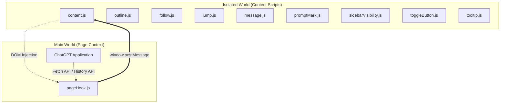

# ChatTOC Architecture

This document describes the design, context boundaries, and module coordination of the ChatTOC Chrome extension.

## Overview

ChatTOC is a Chrome Extension that inserts a table-of-contents sidebar into ChatGPT's chat interface, helping users navigate long conversations and keep track of prompts.

---

## 1. Context Boundaries & Injection Model

Because Chrome Extensions run content scripts in an **Isolated World** (preventing direct access to the page's Javascript variables and window functions), ChatTOC splits its logic into two execution worlds:

### Main World (`pageHook.js`)

- **Purpose**: Injected directly into the ChatGPT page DOM. It intercepts ChatGPT's own native API calls and events.
- **Responsibilities**:
  1. **Fetch Hooking**: Overrides `window.fetch` to intercept chat history payloads (`/backend-api/conversation/*`) and SSE streamed responses (`/backend-api/f/conversation`), posting raw message data back to the Isolated World.
  2. **History Hooking**: Overrides `history.pushState` and `history.replaceState` to notify the content script of SPA route transitions.
  3. **Media Query Spoofing**: Proxies `window.matchMedia` and responsive listeners to fake a wide viewport (e.g. `1400px`), forcing ChatGPT's React app to keep its native navigation buttons mounted even when the user resizes or splits their screen.

### Isolated World (Content Scripts)

- **Purpose**: Declared in `manifest.json`. Runs in a sandboxed context where it can access the DOM and Chrome APIs but not ChatGPT's global Javascript scope.
- **Module Scripts (injected in sequence)**:
  - [outline.js](file:///Users/leo/🔥Projects/chrome-plugins/chat-toc/outline.js): Extracts header trees (`H1`-`H6`) from assistant answers and manages outline expands/collapses.
  - [follow.js](file:///Users/leo/🔥Projects/chrome-plugins/chat-toc/follow.js): Manages scroll tracking on the chat feed and coordinates when the sidebar is allowed to auto-scroll.
  - [message.js](file:///Users/leo/🔥Projects/chrome-plugins/chat-toc/message.js): Parses ChatGPT's JSON payloads and normalizes user inputs/files/images into TOC labels.
  - [promptMark.js](file:///Users/leo/🔥Projects/chrome-plugins/chat-toc/promptMark.js): Handles session-scoped prompt marking (flag icon).
  - [jump.js](file:///Users/leo/🔥Projects/chrome-plugins/chat-toc/jump.js): Controls smooth scrolling to messages, utilizing ChatGPT's native buttons (primary) or direct DOM `scrollIntoView` (fallback).
  - [tooltip.js](file:///Users/leo/🔥Projects/chrome-plugins/chat-toc/tooltip.js): Shows full-text preview tooltips for truncated prompt lines.
  - [toggleButton.js](file:///Users/leo/🔥Projects/chrome-plugins/chat-toc/toggleButton.js): Manages the floating circular toggle button and session-bound drag position.
  - [sidebarVisibility.js](file:///Users/leo/🔥Projects/chrome-plugins/chat-toc/sidebarVisibility.js): Manages sidebar showing, auto-hiding, pinning, and inert accessibility state.
  - [myPrompts.js](file:///Users/leo/🔥Projects/chrome-plugins/chat-toc/myPrompts.js): Manages persistent custom prompt templates (CRUD modal dialogs, list rendering with sort selectors, and input autocomplete popup).
  - [content.js](file:///Users/leo/🔥Projects/chrome-plugins/chat-toc/content.js): Entry point. Injects the Main World script, creates the sidebar DOM, and ties all modules together.

---

## 2. Communication Protocol

Data flows from the page's Hook script to the content script using window messages:

- `CHATGPT_CONVERSATION_DATA`: Sends the full JSON conversation tree on page load or full conversation update.
- `CHATGPT_NEW_USER_MESSAGE`: Streams newly submitted user prompts in real-time.
- `CHATGPT_ROUTE_CHANGED`: Dispatched instantly when a routing URL transition takes place.
- `CHATGPT_NAVIGATOR_SET_WIDTH_SPOOF`: Sent from the content script to toggle media query spoofing on/off when the sidebar visibility state toggles.
