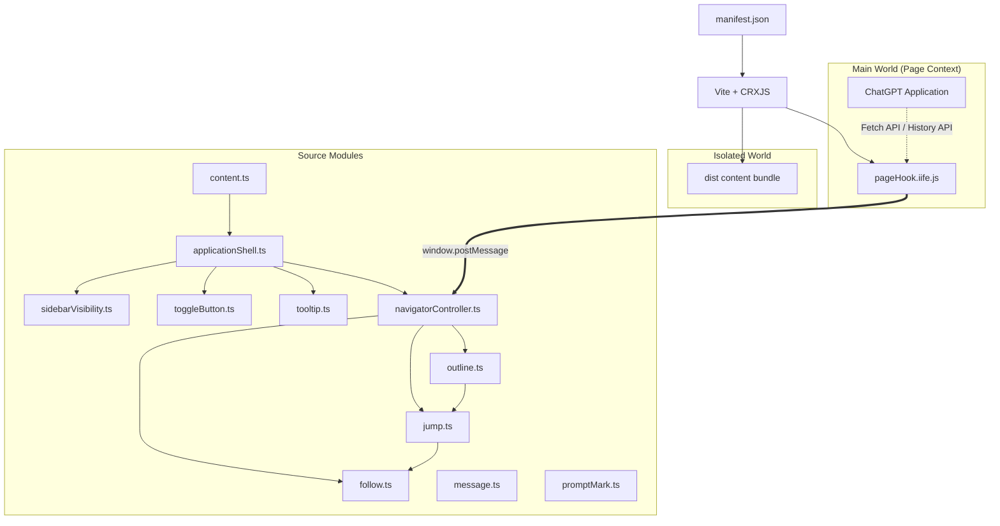

# ChatTOC Architecture

This document describes the design, context boundaries, and module coordination of the ChatTOC Chrome extension.

## Overview

ChatTOC is a Chrome Extension that inserts a table-of-contents sidebar into ChatGPT's chat interface, helping users navigate long conversations and keep track of prompts.

---

## 1. Context Boundaries & Injection Model

Because Chrome Extensions run content scripts in an **Isolated World** (preventing direct access to the page's Javascript variables and window functions), ChatTOC splits its logic into two execution worlds:

```mermaid
graph TD
    manifest[manifest.json]
    vite[Vite + CRXJS]

    subgraph sourceModules["Source Modules"]
        content[content.ts]
        outline[outline.ts]
        follow[follow.ts]
        jump[jump.ts]
        msg[message.ts]
        mark[promptMark.ts]
        vis[sidebarVisibility.ts]
        btn[toggleButton.ts]
        tip[tooltip.ts]
        navigator[navigatorController.ts]
        shell[applicationShell.ts]
    end

    subgraph isolatedWorld["Isolated World"]
        contentBundle[dist content bundle]
    end

    subgraph mainWorld["Main World (Page Context)"]
        hook[pageHook.iife.js]
        chatgpt[ChatGPT Application]
    end

    manifest --> vite
    content --> shell
    shell --> navigator
    shell --> vis
    shell --> btn
    shell --> tip
    navigator --> outline
    navigator --> jump
    navigator --> follow
    outline --> jump
    jump --> follow
    vite --> contentBundle
    vite --> hook
    hook ===>|window.postMessage| navigator
    chatgpt -.->|Fetch API / History API| hook
```

### Main World (`pageHook.iife.js`)

- **Purpose**: Declared as a `MAIN` world IIFE content script and injected by Chrome at `document_start`. It intercepts ChatGPT's own native API calls and events.
- **Responsibilities**:
  1. **Fetch Hooking**: Overrides `window.fetch` to intercept chat history payloads (`/backend-api/conversation/*`) and SSE streamed responses (`/backend-api/f/conversation`), posting raw message data back to the Isolated World.
  2. **History Hooking**: Overrides `history.pushState` and `history.replaceState` to notify the content script of SPA route transitions.
  3. **Media Query Spoofing**: Proxies `window.matchMedia` and responsive listeners to fake a wide viewport (e.g. `1400px`), forcing ChatGPT's React app to keep its native navigation buttons mounted even when the user resizes or splits their screen.

### Isolated World (Content Scripts)

- **Purpose**: `src/content.ts` is declared in `manifest.json` and runs in a sandboxed context where it can access the DOM and Chrome APIs but not ChatGPT's global JavaScript scope.
- **Loading**: `src/content.ts` starts the application shell, and each module imports its explicit dependencies. Vite bundles that graph into one generated Content Script; only the entry remains in the source Manifest.
- **Source modules**:
  - [outline.ts](../src/features/outline.ts): Provides typed answer-heading extraction, outline state, and child-heading navigation through named exports.
  - [follow.ts](../src/features/follow.ts): Provides typed chat-scroll tracking and sidebar auto-follow control through named exports.
  - [message.ts](../src/features/conversationPrompts/message.ts): Defines typed ChatGPT conversation models and normalizes user inputs, files, and images into TOC messages.
  - [promptMark.ts](../src/features/conversationPrompts/promptMark.ts): Provides typed session-scoped prompt marking and mark-button behavior through named exports.
  - [jump.ts](../src/features/jump.ts): Provides typed prompt navigation using ChatGPT's native buttons first and DOM/virtualized-scroll fallbacks second.
  - [tooltip.ts](../src/features/tooltip.ts): Provides typed preview-tooltip and button-tooltip APIs through named exports.
  - [toggleButton.ts](../src/features/toggleButton.ts): Provides the typed floating toggle-button factory and session-bound drag positioning.
  - [sidebarVisibility.ts](../src/features/sidebarVisibility.ts): Provides typed sidebar showing, auto-hiding, pinning, and inert accessibility control.
  - [promptStore.ts](../src/features/myPrompts/promptStore.ts): Defines the saved-prompt model and provides typed persistence, caching, and change notifications.
  - [promptLibrary.ts](../src/features/myPrompts/promptLibrary.ts): Manages the saved prompt list, dialogs, CRUD operations, sorting, import, and export through named exports.
  - [promptAutocomplete.ts](../src/features/myPrompts/promptAutocomplete.ts): Manages composer matching, autocomplete UI, keyboard navigation, and prompt insertion through named exports.
  - [myPrompts.ts](../src/features/myPrompts/myPrompts.ts): Composes the typed My Prompts modules and exports the unified `myPrompts` API consumed by the application shell.
  - [navigatorController.ts](../src/app/navigatorController.ts): Provides typed conversation data, TOC rendering, prompt navigation coordination, route resets, and active-prompt tracking.
  - [applicationShell.ts](../src/app/applicationShell.ts): Provides the typed sidebar shell, view-mode coordination, shared UI, and application initializer.
  - [content.ts](../src/content.ts): Calls the application initializer as the minimal Isolated World entry.

### Build Outputs

- `manifest.json` is the source Manifest and authoritative extension version.
- `vite.config.js` uses Vite and CRXJS to discover the Chrome extension entries.
- `dist/manifest.json` is generated for Chrome and rewrites source entry paths to built assets.
- `dist/` is generated and ignored by Git; run `npm run build` before loading or packaging the extension.
- TypeScript is configured with `allowJs` so source files can migrate from JavaScript incrementally.

---

## 2. Communication Protocol

Data flows from the page's Hook script to the content script using window messages:

- `CHATGPT_CONVERSATION_DATA`: Sends the full JSON conversation tree on page load or full conversation update.
- `CHATGPT_NEW_USER_MESSAGE`: Streams newly submitted user prompts in real-time.
- `CHATGPT_ROUTE_CHANGED`: Dispatched instantly when a routing URL transition takes place.
- `CHATGPT_NAVIGATOR_SET_WIDTH_SPOOF`: Sent from the content script to toggle media query spoofing on/off when the sidebar visibility state toggles.
